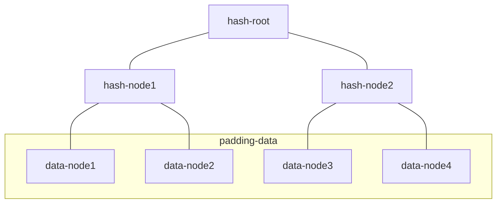

# PC-1(for 8MiB sector)

## 1. Gen mock data in piece-file

piece-file  ## size 8323072 == (8<<20) / 256*254
one data-node(254 bit)

| bit index | 0  | ... | 252  | 253  |
| --------- | -- | --- | ---- | ---- |
| data      | r0 | ... | r252 | r253 |

## 2. Add piece-file to staged-file(with padding)

staged-file  ## size  8388608 == 8<<20
foreach data-node(32 Byte)

| bit index | 0  | ... | 252  | 253  | 254       | 255       |
| --------- | -- | --- | ---- | ---- | --------- | --------- |
| data      | r0 | ... | r252 | r253 | padding 0 | padding 0 |

## 3. just copy staged-file to sealed-file

sealed-file  ## size  8388608 == 8<<20

## 4. use padding data gen bin-merkle-tree

sc-02-data-tree-d.dat ## size 16777184 == 16<<20 - 32

## 5. gen layer  1..N

sc-02-data-layer-1.dat ## size 8388608 == 8<<20
sc-02-data-layer-2.dat ## size 8388608 == 8<<20

| layer(N-1) | node0 | node1 | ... | ... | nodex |
| ---------- | ----- | ----- | --- | --- | ----- |
| layer(N)   | node0 | node1 | ... | NOW |       |

从layer(N-1) 和 layer(N) 中选取几个节点进行hash 得到NOW节点

节点的选取是根据生成的 /var/tmp/filecoin-parents/v28-sdr-parent-*.cache 文件确定的,

本层选6个(上一个节点必选), 上一层选8个
